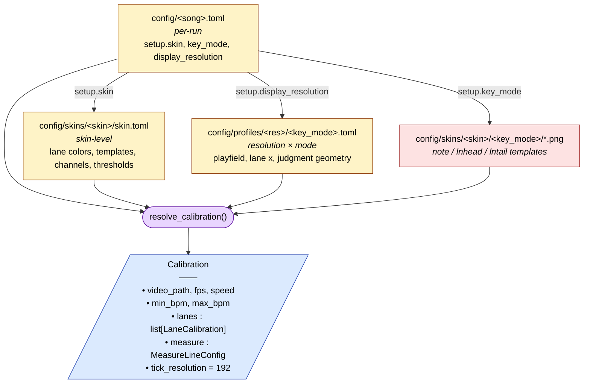
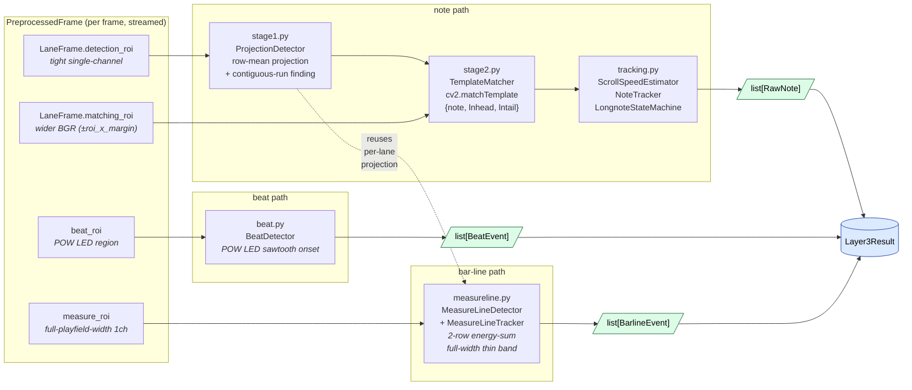
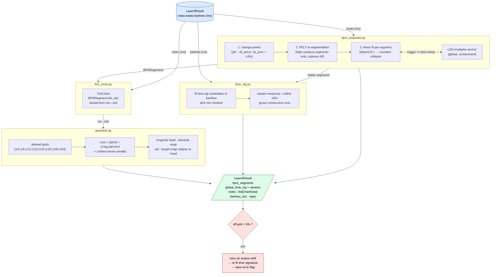
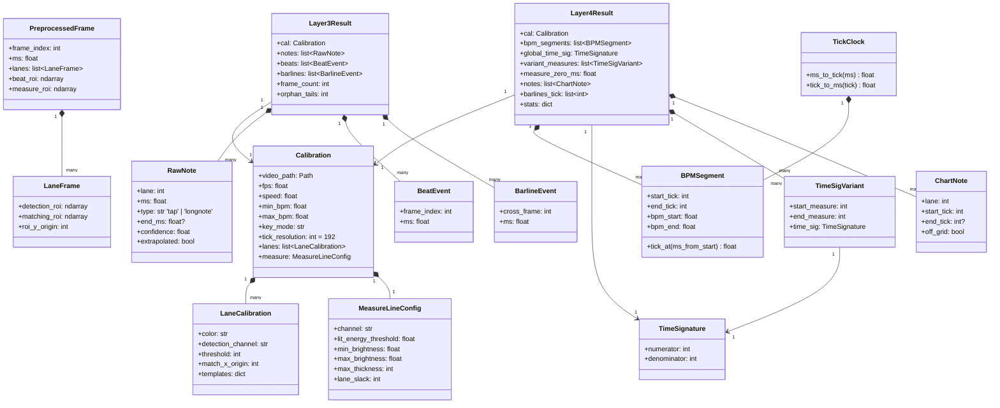

# EZ2CV Architecture

A 5-layer computer-vision pipeline that takes an EZ2ON REBOOT : R gameplay video and reconstructs the chart (JSON). Every diagram below renders as Mermaid in GitHub/VSCode; the same diagrams are exported as static SVG under [doc/svg/](svg/).

> To re-export a diagram as SVG after editing: `mmdc -i doc/ARCHITECTURE.md -o doc/svg/diagram.svg -t neutral -b transparent` (requires system `mermaid-cli`).

---

## 1. End-to-end pipeline

Layer 3 decodes the video exactly once and produces ms-based raw data; everything after that is in-memory transformation (Layer 4) and serialization (Layer 5). Layers 1 and 2 are effectively setup. _Static SVG: [1-pipeline-overview.svg](svg/1-pipeline-overview.svg)_

```mermaid
flowchart LR
    %% Inputs
    cfg["config/&lt;song&gt;.toml"]:::input
    vid[["gameplay.mp4"]]:::input

    %% Layers
    subgraph L1["Layer 1 — Calibration (setup)"]
        direction TB
        l1["resolve_calibration()"]
        cal[("Calibration<br/>(flat)")]:::data
        l1 --> cal
    end

    subgraph L2["Layer 2 — Preprocessor (streaming)"]
        direction TB
        l2["Preprocessor<br/>(generator)"]
        pf[("PreprocessedFrame<br/>per frame")]:::data
        l2 -. yields .-> pf
    end

    subgraph L3["Layer 3 — 1-Pass detection (ms-based)"]
        direction TB
        l3["Layer3Pipeline.run()"]
        l3r[("Layer3Result<br/>notes / beats / barlines")]:::data
        l3 --> l3r
    end

    subgraph L4["Layer 4 — 2-Pass (ms → tick)"]
        direction TB
        l4["Layer4Result.from_layer3()"]
        l4r[("Layer4Result<br/>BPMSegments + ChartNotes")]:::data
        l4 --> l4r
    end

    subgraph L5["Layer 5 — Serialization"]
        direction TB
        l5["write_all()"]
        raw[/"out/&lt;song&gt;/raw.json"/]:::output
        chart[/"out/&lt;song&gt;/chart.json"/]:::output
        viz[/"chart_visual.png"/]:::output
        l5 --> raw
        l5 --> chart
        l5 --> viz
    end

    cfg --> l1
    cal --> l2
    vid --> l2
    cal --> l3
    pf -- per-frame stream --> l3
    l3r --> l4
    cal --> l4
    l3r --> l5
    l4r --> l5

    classDef input  fill:#fef3c7,stroke:#92400e,color:#000
    classDef data   fill:#dbeafe,stroke:#1e40af,color:#000
    classDef output fill:#dcfce7,stroke:#166534,color:#000
```



Key design decisions:

- **One decode, three paths.** Layer 3 decodes the video exactly once and extracts notes, beats, and barlines in parallel. Later experiments (different BPM assumptions, different snapping) reuse the raw result.
- **Layer 3 stops at milliseconds.** BPM, ticks, and grid snapping all belong to Layer 4, so the expensive video pass does not depend on any grid assumption.
- **Streaming.** Layer 2 is a generator, so memory usage stays flat regardless of video length.

---

## 2. Config resolution chain (Layer 1)

Three TOML tiers collapse into a single `Calibration` object. No layer below this one reads TOML directly. _Static SVG: [2-config-chain.svg](svg/2-config-chain.svg)_



| File | Change frequency | Purpose |
| --- | --- | --- |
| `config/<song>.toml` | per song | video path, FPS, speed, BPM range, time-signature candidates |
| `skins/<skin>/skin.toml` | when adding a skin | lane colors, template filenames, detection channels, thresholds |
| `profiles/<res>/<key_mode>.toml` | when calibrating a resolution × key mode | pixel-level geometry |

To calibrate a new resolution, add `profiles/<W>x<H>/<keymode>.toml`. Only `5k @ 1920x1080` is fully calibrated today.

---

## 3. Layer 2 → Layer 3 data fan-out

A single `PreprocessedFrame` branches into three independent paths. _Static SVG: [3-layer3-fanout.svg](svg/3-layer3-fanout.svg)_



Design invariants:

- **No normalization.** Thresholds are absolute 0–255 values; normalizing would break them.
- **Coordinate convention.** `roi_y_origin + in-ROI y = full-frame y`, and `lane.match_x_origin + in-ROI x = full-frame x`.
- **Barline path free-rides Stage 1.** The measure-line detector reuses the per-lane projection that Stage 1 already computes, so it costs almost zero extra work.
- **Energy-sum lit test (sub-pixel robustness).** A 1px barline scrolling ~33px/frame straddles two pixel rows and splits its energy below any single-row brightness gate, so a raw row-mean test flickers and drops whole measures. The detector instead thresholds the **2-row sliding energy sum** (`proj[y] + proj[y+1]`), which recombines the split energy regardless of straddle phase (4-song recall 94–96%, FP~0). The `max_thickness` gate still rejects long-note bodies, so recovering dim rows does not let thick objects through.
- **Why POW LED.** The LED flicker is a tempo signal that is immune to scroll-speed changes (SV). Barlines give measure phase; LED gives beat phase — both are needed.
- **Beat onset = rise edge, not peak.** `BeatEvent.frame_index` is the **last dark frame** before the LED jumps (i.e. one frame before the detection frame), not the first bright frame. Verified against barline crossings: reporting the peak gives a systematic ~1.8 frame lag; reporting the rise edge halves it to ~0.8 frames. A residual ~0.8-frame lag (std 0.33) remains — this is the game itself rendering the LED flash ~1 frame after the visual barline crossing, and must be absorbed by Layer 4's LED-multiplier anchor rather than re-fought here.

---

## 4. Layer 4 — ms → tick algorithm flow

Layer 4 consumes Layer 3's ms-domain result, decides BPM / time signature / grid, and converts everything to ticks. Module decomposition is intentionally small — `bpm_estimator` and `quantizer` are pure-function modules. _Static SVG: [4-layer4-algorithm.svg](svg/4-layer4-algorithm.svg)_



Algorithm highlights:

- **Piecewise-linear BPM.** A gradual BPM change is expressed as a single segment in closed form; constant BPM automatically collapses to slope=0.
- **LED-multiplier anchor.** The POW LED can flash 0.5, 1, or 2 times per beat; the global `2^k` factor is decided up-front so the rest of the pipeline cannot mis-pick the octave.
- **Negative ticks.** Pickup notes that sit within one measure before the first barline are preserved with negative tick values.
- **Context-aware snapping.** If neighbors land on 1/16, candidate 1/24 / 1/48 positions for adjacent notes get a penalty — prevents triplet vs. duple confusion.
- **Determinism.** All stochastic steps (e.g., PELT) use a fixed seed. Same input → same output.

---

## 5. Core data types

The dataclasses that cross layer boundaries. All plain dataclasses — no inheritance, no ORM. _Static SVG: [5-data-model.svg](svg/5-data-model.svg)_



---

## 6. Call tree at a glance

The exact call order driven by `src/main.py`.

```text
main.py:run()
├── layer1.calibration.resolve_calibration(cfg)         → Calibration
├── layer2.preprocessor.Preprocessor(cal)               → streaming generator
├── layer3.Layer3Pipeline(cal).run()                    → Layer3Result
│   └─ for frame in preprocessor:                       (single decode pass)
│        ├── ProjectionDetector       (stage 1)
│        ├── TemplateMatcher          (stage 2)
│        ├── NoteTracker + LongnoteStateMachine
│        ├── BeatDetector             (POW LED)
│        └── MeasureLineDetector + Tracker
├── layer4.Layer4Result.from_layer3(l3)                 → Layer4Result
│   └─ bpm_estimator → time_sig → tick_clock → quantizer
└── layer5.write_all(l3, l4)                            → raw.json, chart.json
    └─ optional: visualize_chart.render(...)            → chart_visual.png
```

Each layer's `__main__` block is a standalone debug CLI (`uv run python src/layerN/*.py "config/*.toml"`). Production runs go through `src/main.py`.
