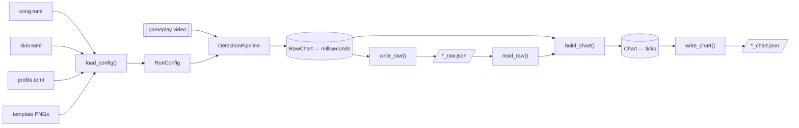
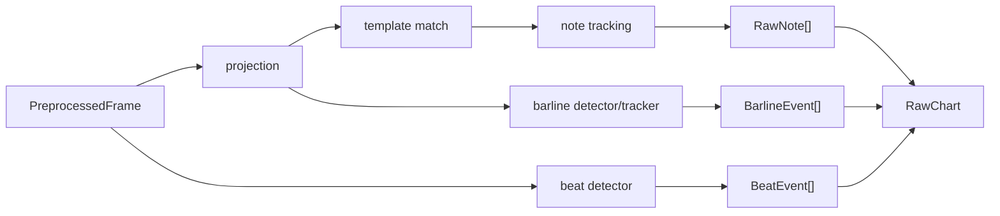

# EZ2CV Architecture

EZ2CV has two computational phases separated by a durable JSON checkpoint:
video detection in milliseconds, followed by musical chart inference in ticks.

## Package structure

```text
src/ez2cv/
├── cli.py                 command orchestration
├── config.py              TOML resolution and validation
├── video.py               streaming OpenCV frame source
├── detection/
│   ├── pipeline.py        one-pass detector and RawChart
│   ├── stage1.py          row projection and run detection
│   ├── stage2.py          constrained template matching
│   ├── tracking.py        temporal tracking and long-note pairing
│   ├── beat.py            POW LED beat detection
│   └── barline.py         measure-line detection and tracking
├── chart/
│   ├── pipeline.py        RawChart → Chart
│   ├── timeline.py        joint meter/tempo inference
│   ├── barline.py         arbitrary meter-sequence reconstruction
│   ├── clock.py           canonical BPM-segment ms ↔ tick conversion
│   ├── meter.py           time-signature data
│   └── quantize.py        musical-grid snapping
├── io.py                  raw/chart JSON read and atomic write
└── visualize.py           final chart renderer
```

The package names describe responsibility. There are no numbered layers or
single-implementation interfaces.

## End-to-end flow



`write_raw()` runs immediately after detection and before chart inference. If
BPM, meter, or quantization fails, the expensive video result is already safe
and can be retried with `ez2cv *_raw.json --from-raw`.

## Configuration boundary

`load_config()` merges three TOML tiers:

| Input | Responsibility |
| --- | --- |
| `config/<song>.toml` | video, difficulty, FPS, note speed, tick resolution, BPM range |
| `config/skins/<skin>/skin.toml` | colors, templates, channels, thresholds |
| `config/profiles/<resolution>/<mode>.toml` | pixel geometry and measured speed |

The resulting `RunConfig` contains decoded OpenCV templates and therefore stays
inside video/detection code. It validates key counts, channels, geometry, BPM,
FPS, the judgment-band alignment calibration, and the profile's note speed.

The 1920×1080 profiles cover 4K, 5K, 6K, and 8K. Only 5K has been verified on
real recordings; the other modes are centered bootstrap geometry and must be
recalibrated when the panel differs.

## Detection phase

`video.Preprocessor` sequentially decodes the video and yields one
`PreprocessedFrame` at a time. Memory use therefore stays independent of video
length. Each frame fans out to three paths:



Important invariants:

- Decode-time resolution must exactly match the geometry profile. The initial
  two seconds are searched for the calibrated cyan judgment band, then the
  main decode restarts at frame zero and normalizes translation of every lane
  and beat ROI while retaining the profile's logical coordinates.
  Only translation within the configured limit is accepted; scale, rotation,
  a missing band, and FPS mismatch fail unless `--force` explicitly accepts
  the uncorrected calibration.
- Detection thresholds use unnormalized 0–255 channel values.
- Stage 1 is recall-oriented; Stage 2 provides template precision.
- The barline detector reuses Stage 1 projections and uses two-row energy to
  tolerate sub-pixel line motion.
- Beat events report the rise edge of the POW LED flash.
- Fractional frame crossings are mapped through decoded container PTS; a
  provenance-marked configured-FPS fallback is used only when the backend does
  not expose a monotonic presentation timeline. Raw duration is derived from
  the same decoded PTS timeline.
- Tracking interpolates bracketed judgment-line crossings. Tap and longnote-tail
  near misses use a regression over the latest local trajectory, with global
  scroll speed as a gate and fallback. Held longnote heads retain global-speed
  projection because their visible path can contain a stationary hold gap.
  Each endpoint records its own timing uncertainty.
- Detection stops at milliseconds and has no BPM or grid dependency.

## Raw checkpoint

`RawChart` contains only JSON-safe primitives and event dataclasses:

- song/skin/key-mode metadata and ordered normal/overlay tracks;
- FPS, frame count, video resolution, and source path;
- tick resolution and BPM bounds needed for chart reconstruction;
- raw notes, beats, barlines, confidence, extrapolation diagnostics, and
  separate head/tail timing sigma and pairing status (legacy checkpoints
  default missing uncertainty to zero).

It does not retain OpenCV image arrays. It does retain the resolved scalar
configuration plus SHA-256 fingerprints for source TOMLs, templates, and video,
so a checkpoint identifies the exact detector inputs without embedding them.
`serialize_raw()` and `read_raw()` form a schema-versioned round trip.

## Chart phase

`build_chart(raw)` performs no video or TOML I/O:

1. Test long gaps as hidden beats and split short intervals as false beats.
   Meter simplicity, tempo continuity, edit cost, and the raw-onset grid fit
   share one candidate score, so an intentional slow beat is not filled merely
   because a constant meter would be simpler.
2. Index detected barlines on the repaired beat stream.
3. Use dynamic programming to drop false lines, infer hidden boundaries, and
   choose each measure's numerator from 1 through 7.
4. Align every active beat observation to the measured barline phases, then
   fit step-BPM and linear-time ramp candidates. A second dynamic program
   selects spans using frame-normalized timing residual plus explicit
   tempo-change and ramp complexity costs. Two bounded change-cost candidates
   are compared by base-grid outlier count; raw notes remain auxiliary evidence.
   A bounded candidate is rejected when its completed canonical clock exceeds
   the global beat-residual tolerance, preventing local clamps from accumulating.
   The selected clock is phase-fitted to barlines, then a bounded 0.25-BPM
   normalized alternative is kept only when that auxiliary score improves.
5. Test a two-beat constant span for a symmetric low-half/high/low-half tempo
   pattern only when an adjacent high-tempo span and raw-note grid both support
   it. This recovers changes hidden between beat flashes.
6. Build one canonical `TickClock`; conversion uses the same BPM segments and
   tick-zero offset that are serialized.
7. Convert note times to ticks. Each measure starts with the
   `{1/4, 1/8, 1/12, 1/16, 1/24, 1/32}` vocabulary and opts into
   `1/48`, `1/64`, `1/96`, or `1/192` only when multiple distinct onsets
   support the finer grid. Repeated fine heads set a chart-wide floor and use
   tempo-segment phase calibration; coarse charts use a stronger simplicity
   prior. Tails cannot promote the per-measure head vocabulary from uncorrected
   observations.
   Near-simultaneous chord lanes count as one onset.
   `fine_grid_ratio` records notes rescued by that expansion. A remaining miss
   within twice its measured endpoint timing sigma is reported separately as
   `timing_uncertain_ratio`; `timing_outlier_ratio` is reserved for misses not
   explained by crossing uncertainty. `base_grid_outlier_ratio` preserves the
   sum of all three for before/after comparison, and
   `measure_grid_max_denominator` records the selected level per measure.
8. Estimate a non-positive chart-wide early tail-observation bias, select a
   shared tail vocabulary from repeated evidence, and re-fit that bias against
   the selected vocabulary. Compare adaptive absolute-tail and relative-length
   snaps. A failed tail snap remains a reviewable longnote instead of silently
   becoming a tap.

The output `Chart` owns only chart metadata, BPM segments, time signatures,
notes, barline ticks, statistics, and per-note diagnostics. Neither `RawChart`
nor `Chart` depends on
detection configuration objects. `write_chart()` serializes it as
`ez2cv.chart` 3.3: `meta.game` identifies the game, each track declares its
input type, timing lives under one `timing` object, fixed and ramped BPM
segments declare their interpolation, meter changes are tick-addressed events,
and derived statistics and diagnostics live under `analysis`.

## Verification

`tests/` contains standard-library `unittest` checks plus a procedural lossless
video that exercises decode, detection, pairing, timeline inference, snapping,
and chart serialization end to end.
