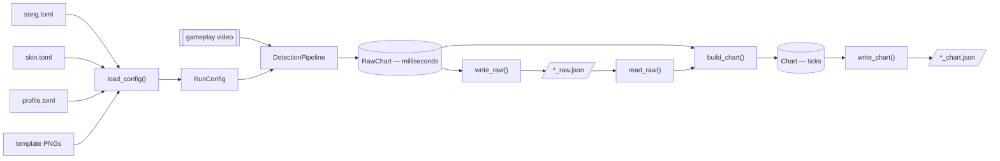
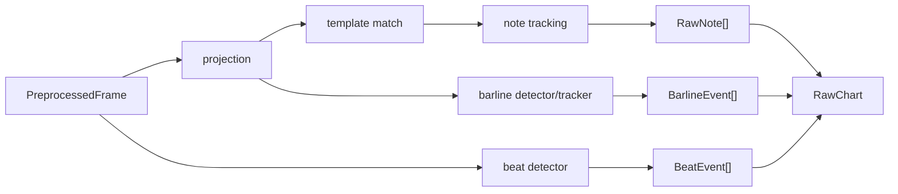

# EZ2CV Architecture

EZ2CV has two computational phases separated by a durable JSON checkpoint:
video detection in milliseconds, followed by musical chart inference in ticks.

## Package structure

```text
src/ez2cv/
├── cli.py                 command orchestration
├── config.py              TOML resolution and validation
├── video.py               streaming OpenCV frame source
├── detection/
│   ├── pipeline.py        one-pass detector and RawChart
│   ├── stage1.py          row projection and run detection
│   ├── stage2.py          constrained template matching
│   ├── tracking.py        temporal tracking and long-note pairing
│   ├── beat.py            POW LED beat detection
│   └── barline.py         measure-line detection and tracking
├── chart/
│   ├── pipeline.py        RawChart → Chart
│   ├── barline.py         missing/false barline reconstruction
│   ├── bpm_barline.py     primary barline-domain BPM estimator
│   ├── bpm.py             beat-domain BPM fallback
│   ├── clock.py           piecewise-linear ms ↔ tick conversion
│   ├── meter.py           time signatures and barline ticks
│   └── quantize.py        musical-grid snapping
├── io.py                  raw/chart JSON read and atomic write
└── visualize.py           final chart renderer
```

The package names describe responsibility. There are no numbered layers or
single-implementation interfaces.

## End-to-end flow



`write_raw()` runs immediately after detection and before chart inference. If
BPM, meter, or quantization fails, the expensive video result is already safe
and can be retried with `ez2cv *_raw.json --from-raw`.

## Configuration boundary

`load_config()` merges three TOML tiers:

| Input | Responsibility |
| --- | --- |
| `config/<song>.toml` | video, FPS, note speed, tick resolution, BPM range |
| `config/skins/<skin>/skin.toml` | colors, templates, channels, thresholds |
| `config/profiles/<resolution>/<mode>.toml` | pixel geometry and measured speed |

The resulting `RunConfig` contains decoded OpenCV templates and therefore stays
inside video/detection code. It validates key counts, channels, geometry, BPM,
FPS, and the profile's calibrated note speed.

The 1920×1080 profiles cover 4K, 5K, 6K, and 8K. Only 5K has been verified on
real recordings; the other modes are centered bootstrap geometry and must be
recalibrated when the panel differs.

## Detection phase

`video.Preprocessor` sequentially decodes the video and yields one
`PreprocessedFrame` at a time. Memory use therefore stays independent of video
length. Each frame fans out to three paths:



Important invariants:

- Detection thresholds use unnormalized 0–255 channel values.
- Stage 1 is recall-oriented; Stage 2 provides template precision.
- The barline detector reuses Stage 1 projections and uses two-row energy to
  tolerate sub-pixel line motion.
- Beat events report the rise edge of the POW LED flash.
- Tracking interpolates judgment-line crossings and marks extrapolated events.
- Detection stops at milliseconds and has no BPM or grid dependency.

## Raw checkpoint

`RawChart` contains only JSON-safe primitives and event dataclasses:

- song/skin/key-mode metadata and lane colors;
- FPS, frame count, video resolution, and source path;
- tick resolution and BPM bounds needed for chart reconstruction;
- raw notes, beats, barlines, confidence, and extrapolation diagnostics.

It does not retain `RunConfig`, OpenCV images, template arrays, or filesystem
configuration state. `serialize_raw()` and `read_raw()` form a schema-versioned
round trip.

## Chart phase

`build_chart(raw)` performs no video or TOML I/O:

1. Index detected barlines on the beat stream.
2. Drop false barlines and infer missing boundaries.
3. Determine global and variant meters.
4. Estimate BPM from measure spans; fall back to beat intervals when meters are
   unreliable.
5. Build a piecewise-linear `TickClock` anchored at the first barline.
6. Convert note times to ticks and snap heads to
   `{1/4, 1/8, 1/12, 1/16, 1/24, 1/32}` grids.
7. Snap long-note lengths relative to their snapped heads.

The output `Chart` owns only chart metadata, BPM segments, time signatures,
notes, barline ticks, and statistics. Neither `RawChart` nor `Chart` depends on
detection configuration objects.

## Verification

`tests/` contains standard-library `unittest` checks for configuration
consistency, clock round trips, grid snapping, variant meters, missing barline
reconstruction, schema rejection, and raw checkpoint round trips followed by
chart regeneration.
