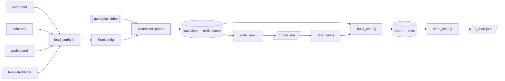
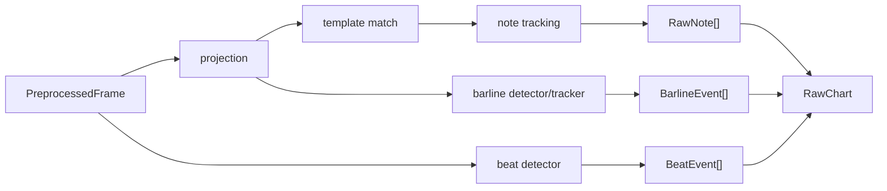

# EZ2CV Architecture

EZ2CV has two computational phases separated by a durable JSON checkpoint:
video detection in milliseconds, followed by musical chart inference in ticks.

## End-to-end flow

The raw checkpoint is written before chart inference, so chart conversion can
be retried without decoding the video again.

## Configuration boundary

`load_config()` merges three TOML tiers:

| Input | Responsibility |
| --- | --- |
| `config/<song>.toml` | video, difficulty, FPS, note speed, tick resolution, BPM range |
| `config/skins/<skin>/skin.toml` | colors, templates, channels, thresholds |
| `config/profiles/<resolution>/<mode>.toml` | pixel geometry and measured speed |

`RunConfig` contains decoded templates and stays inside video/detection code. It
validates key counts, channels, geometry, timing bounds, and profile calibration.

The 1920×1080 profiles cover 4K, 5K, 6K, and 8K. Only 5K has been verified on
real recordings; the other modes are centered bootstrap geometry and must be
recalibrated when the panel differs.

## Detection phase

`Preprocessor` streams one frame at a time into three paths:

Important invariants:

- Decode-time resolution must exactly match the geometry profile. The initial
  two seconds are searched for the calibrated cyan judgment band, then the
  main decode restarts at frame zero and normalizes translation of every lane
  and beat ROI while retaining the profile's logical coordinates.
  Only translation within the configured limit is accepted; scale, rotation,
  a missing band, and FPS mismatch fail unless `--force` explicitly accepts
  the uncorrected calibration.
- Detection thresholds use unnormalized 0–255 channel values.
- Stage 1 is recall-oriented; Stage 2 provides template precision.
- The barline detector reuses Stage 1 projections.
- Beat events report the rise edge of the POW LED flash.
- Fractional frame crossings are mapped through decoded container PTS; a
  provenance-marked configured-FPS fallback is used only when the backend does
  not expose a monotonic presentation timeline. Raw duration is derived from
  the same decoded PTS timeline.
- Tracking interpolates judgment-line crossings and records separate head/tail
  timing uncertainty.
- Detection stops at milliseconds and has no BPM or grid dependency.

## Raw checkpoint

`RawChart` contains JSON-safe metadata and events:

- song/skin/key-mode metadata and ordered normal/overlay tracks;
- FPS, frame count, video resolution, and source path;
- tick resolution and BPM bounds needed for chart reconstruction;
- raw notes, beats, barlines, confidence, extrapolation state, head/tail timing
  sigma, and pairing status.

It excludes image arrays but stores resolved scalar configuration and source,
template, and video fingerprints.

## Chart phase

`build_chart(raw)` performs no video or TOML I/O:

1. Evaluate hidden-beat insertion and false-beat deletion using meter, tempo,
   edit, and raw-onset grid costs.
2. Index detected barlines on the repaired beat stream.
3. Use dynamic programming to drop false lines, infer hidden boundaries, and
   choose each measure's numerator from 1 through 7.
4. Fit step and linear-ramp tempo candidates with residual and complexity costs.
   Reject bounded clocks with excessive completed-clock residual, phase-fit the
   result to barlines, and retain BPM normalization only when grid fit improves.
5. Recover supported tempo changes hidden between beat flashes.
6. Build one canonical `TickClock`; conversion uses the same BPM segments and
   tick-zero offset that are serialized.
7. Snap note heads to a measure-adaptive grid from `1/4` through `1/192`.
   Fine grids require repeated distinct onsets; chord lanes count as one onset.
   Timing misses covered by endpoint uncertainty are reported separately.
8. Snap longnote lengths relative to their snapped heads. DJMAX visual-edge
   offsets remain calibrated per track during detection.

`Chart` contains metadata, BPM and meter timelines, notes, barlines, statistics,
and per-note diagnostics. It does not depend on detection configuration objects;
each serialized track retains its input type.

## Verification

`tests/` contains standard-library `unittest` checks plus a procedural lossless
video that exercises decode, detection, pairing, timeline inference, snapping,
and chart serialization end to end.
